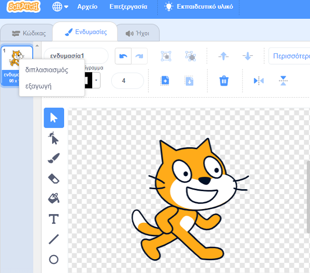

- Κάνε κλικ στην καρτέλα "Ενδυμασίες" και θα δεις την ενδυμασία του αντικειμένου σου.
- Κάνε δεξί κλικ στην ενδυμασία και ξανά κλικ στον διπλασιασμό για να δημιουργήσεις ένα αντίγραφο της ενδυμασίας

